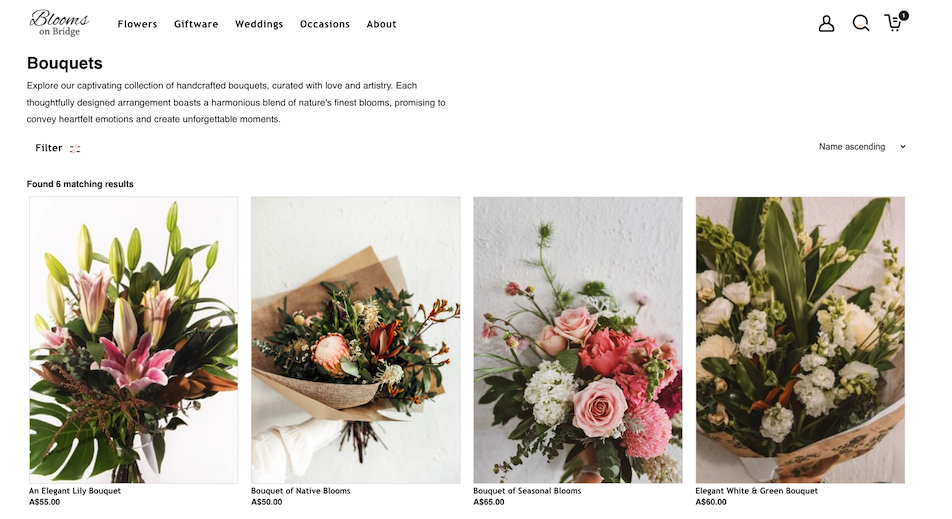

# Blooms on Bridge NextJS Store

A fully-working ecommerce storefront built for a Florist client with Next.js
that runs on the headless ecommerce & GraphQL based Product Information
Management service [Crystallize][5].

Other integrations include [Stripe][0] for payment handling and [SendGrid][1]
for email order confirmations with Webhooks and magic link sign in.

See here for [The Service API repo][2] which manages the backend functionality
via Vercel serverless functions.

## See LIVE demo

Staging site: [Blooms on Bridge][3].

## Introduction

I wanted to use this project to learn a range of new technology
(Next.js/GraphQL/Stripe API/Webooks) rather than utilise a tech stack I was
already completly comfortable with.

I decided to use Crystallize as a CSM/PIM platform because they had user
friendly portal for the florist shop, excellent developer documentation and some
great [boilerplates][4] to get started with.

## App Structure

### `src/pages/`

Entry pages - interpreted as separate routes by Next.js.

### `src/pages/api/`

Vercel [serverless functions][18].

### `src/page-components/`

Holds the actual component content related to entries in the `pages/` directory.

### `src/components/`

Shared React components.

### `src/shapes/`

The Crystallize system for managing `folders`, `products` & `documents`.
Contains components, styles, graphql queries and more.

### `src/ui/`

UI related components live here. Color variables and simple shared components

### `src/lib/`

Enable GraphQL and REST API communication and more for the browser client

### `public/static/`

Public resources hosted as static files

## License

Open-source and MIT license.

[0]: https://stripe.com/au
[1]: https://sendgrid.com/
[2]: https://github.com/mountmike/blooms-on-bridge-SERVICE-API
[3]: https://blooms-on-bridge-crystallize.vercel.app/
[4]: https://crystallize.com/learn/open-source/boilerplates/react-nextjs
[5]: https://crystallize.com/
[18]: https://vercel.com/docs/v2/serverless-functions/introduction
